Stock Special Route
===================
This module allows to define multiple paths inside the same stock route.

.. contents:: Table of Contents

Context
-------
In vanilla Odoo, routes are hardly customizable.

All steps (stock rules) defined on a delivery or receipt route are applied for all products.

Therefore, the only way to achieve multiple paths per warehouse for different products would be to
create as many routes for each warehouse.

The problem is that you end up with a very complex configuration.
Because the sequence order of routes is important when routing products, it becomes hard to reason about.

Overview
--------
The module adds the concept of a special route.

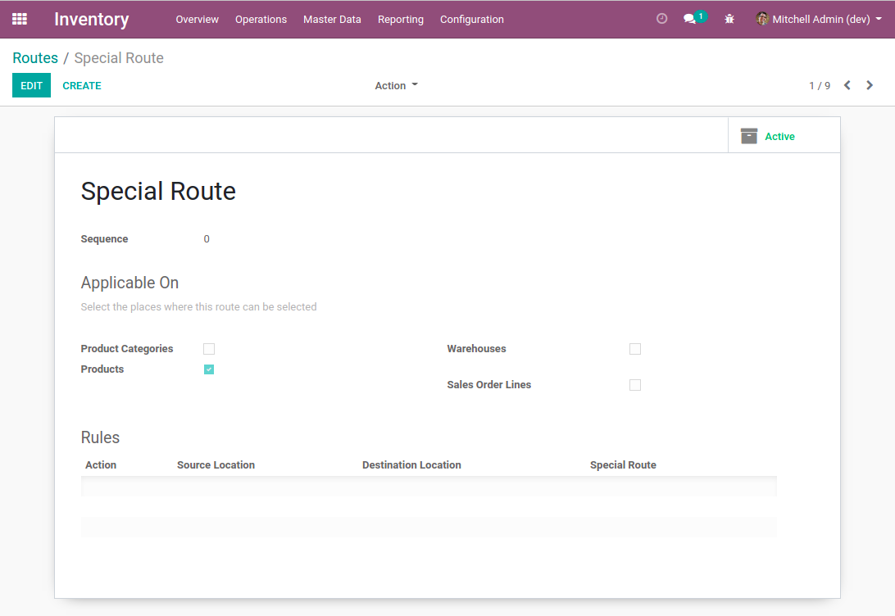

A special route is a route used to filter the rules to apply for another route.

For example, you may define a purchase route with two or three steps.

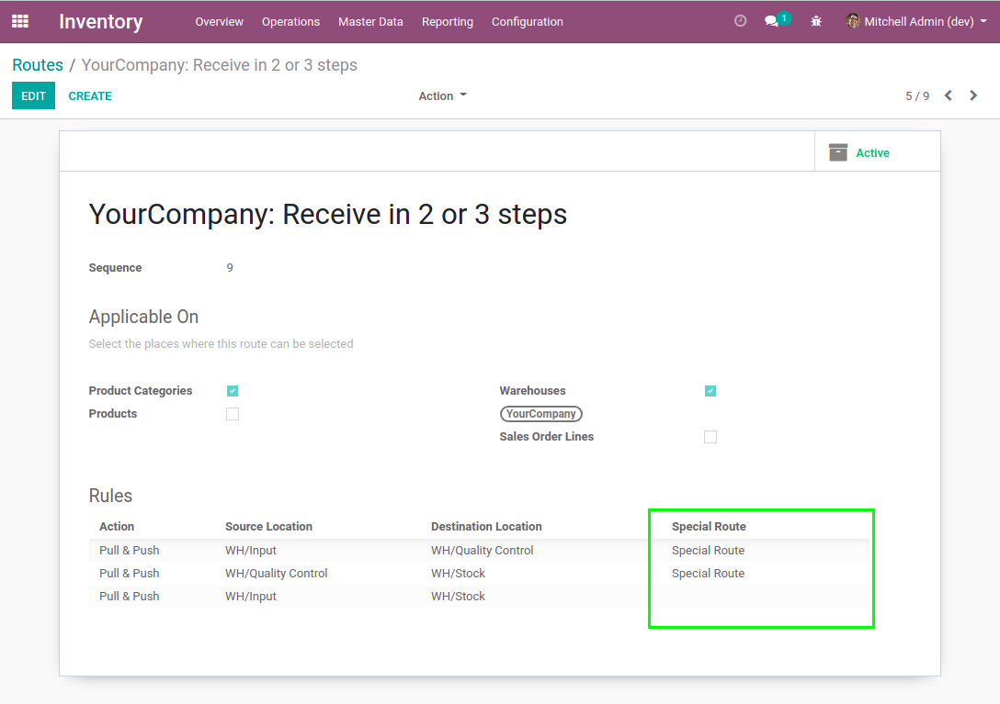

The special route is set on the first two rules.
These rules will be applied only for products linked to the special route.

The third rule will be applied as fallback for other products.

Therefore, some products will be received in three steps and others will be received in two steps.

Rule Order
~~~~~~~~~~
Because stock rules are evaluated in order of sequence, it is important that rules
with a special route appear first in sequence.

Configuration
-------------
I create a new route ``Quality Control``.

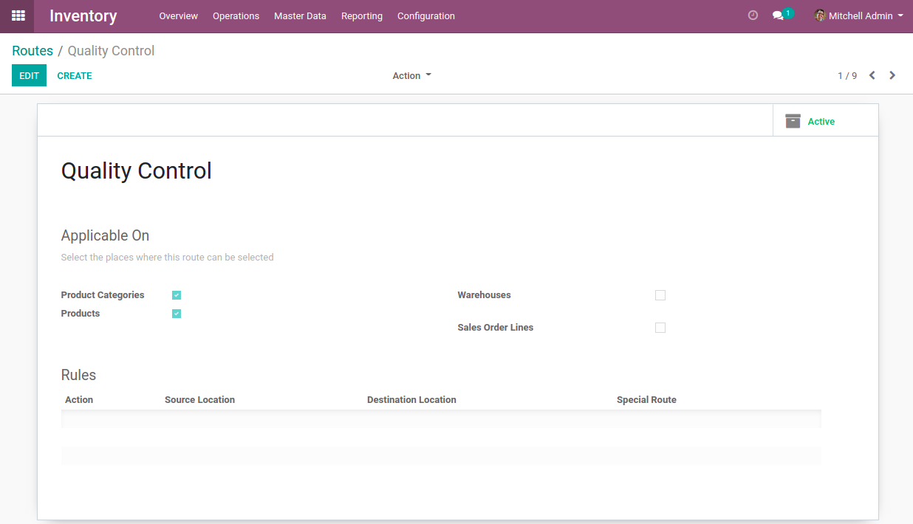

I go to the form view of my warehouse. I select the option to receive products in 3 steps.

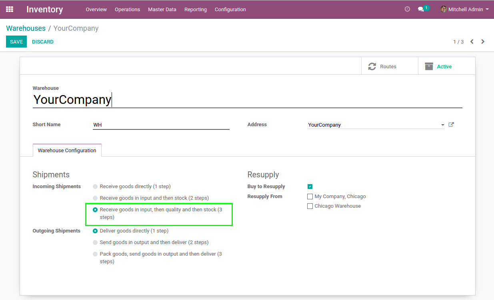

I go to the form view of the receipt route.

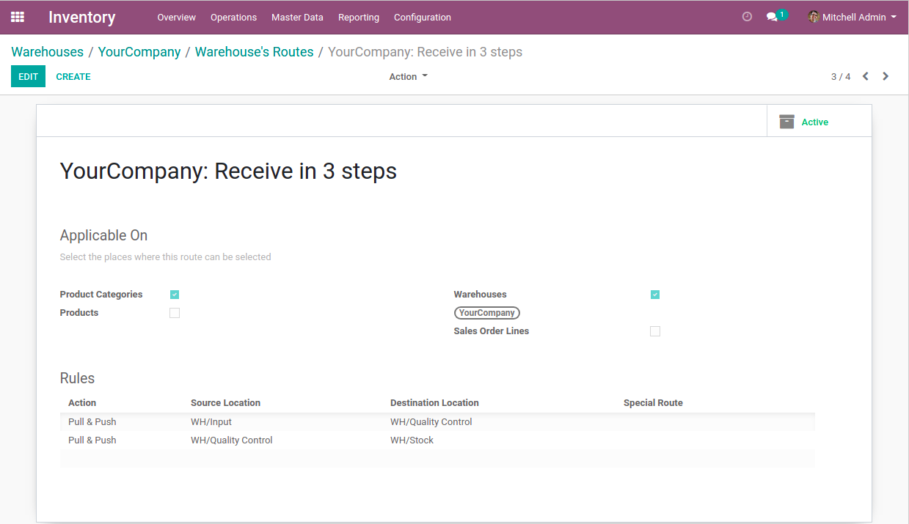

On the two existing rules, I select the special route.

Then, I add a third rule as fallaback from ``Input to Stock``.
This rule is applied for products that don't require quality control.

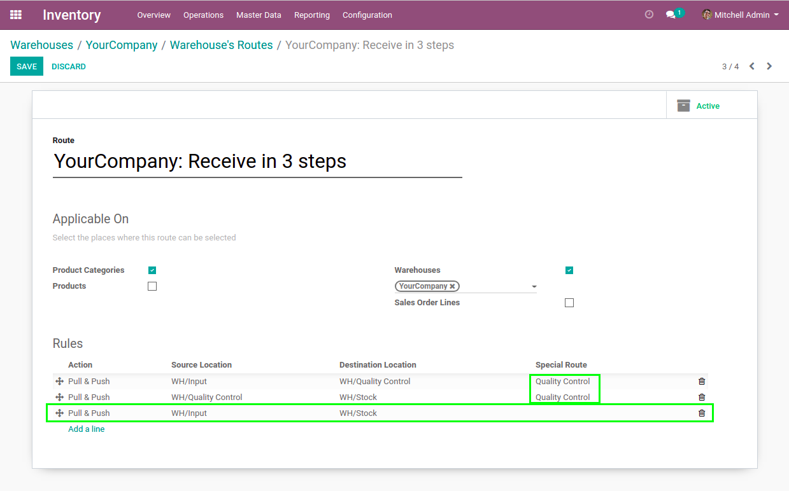

Usage
-----
I set up a product with the ``Quality Control`` route.

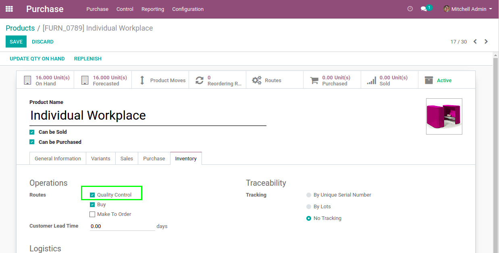

I set up a second product without the route.

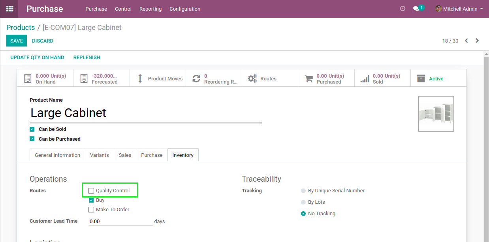

I create a purchase order with both products.

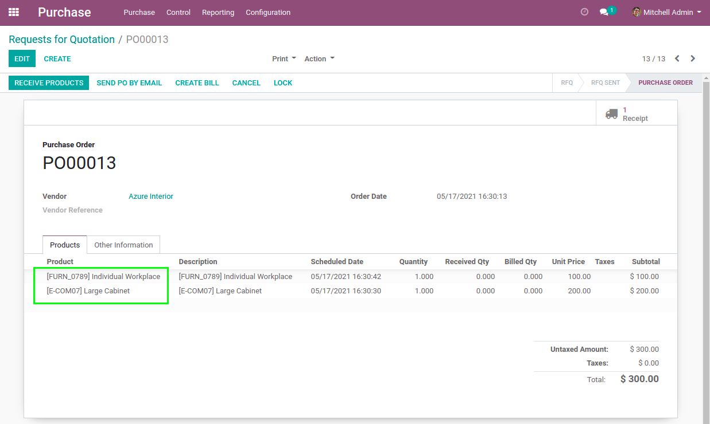

I process the receipt.

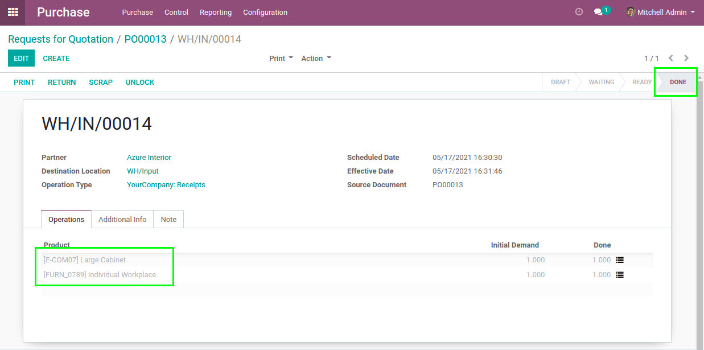

I notice that the first product goes through ``Quality Control``.

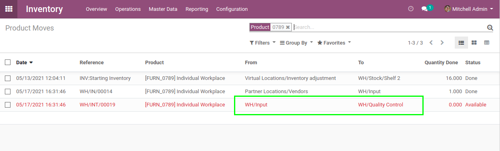

The second product goes directly to ``Stock``.

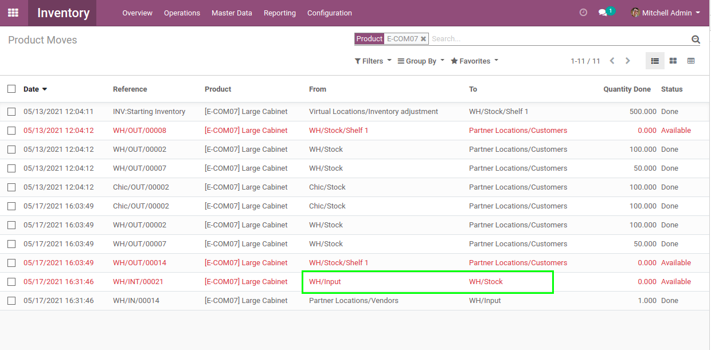

Known Issues
------------

Performance
~~~~~~~~~~~
The module stock_route_optimized improves the performance of stock rules in the context of procurements (pull).

However, this improvement does not concern push operations for now.

In order to filter stock rules per special route in the context of push operations,
this module decreases performance.

This issue could be fixed in future improvement of the module stock_route_optimized.

Implied Receipt Step
~~~~~~~~~~~~~~~~~~~~
In a receipt route, there is always a rule (step) that is implied.

This step is created when confirming the purchase Order.
It uses the default destination location defined on the receipt picking type of the warehouse.

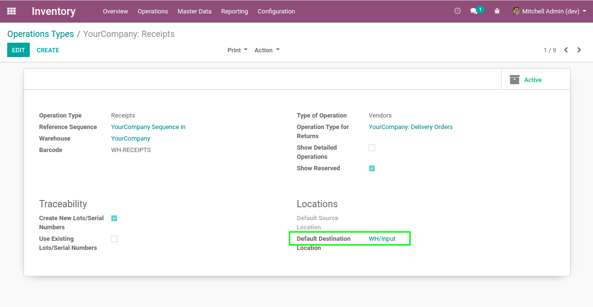

For now, this step is not customizable using special routes.

Contributors
------------
* Numigi (tm) and all its contributors (https://bit.ly/numigiens)
