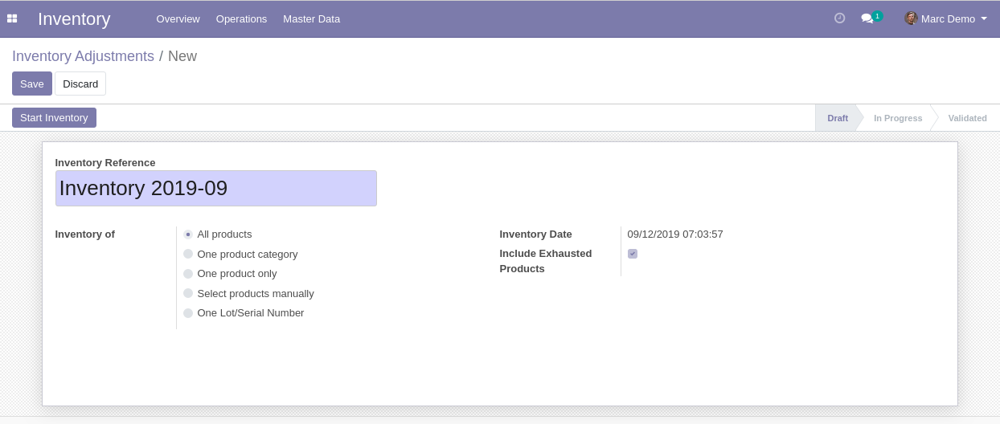
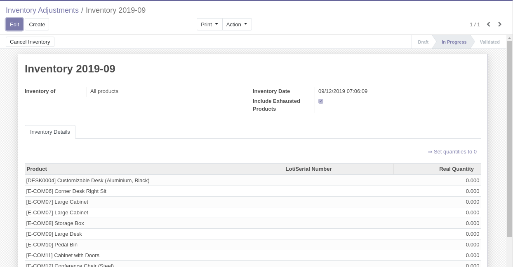
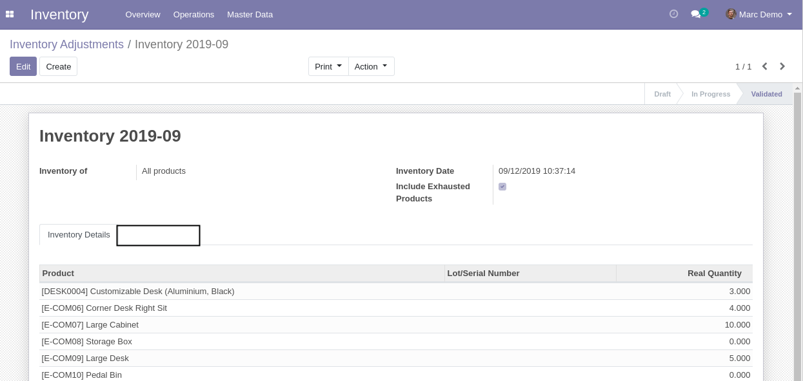
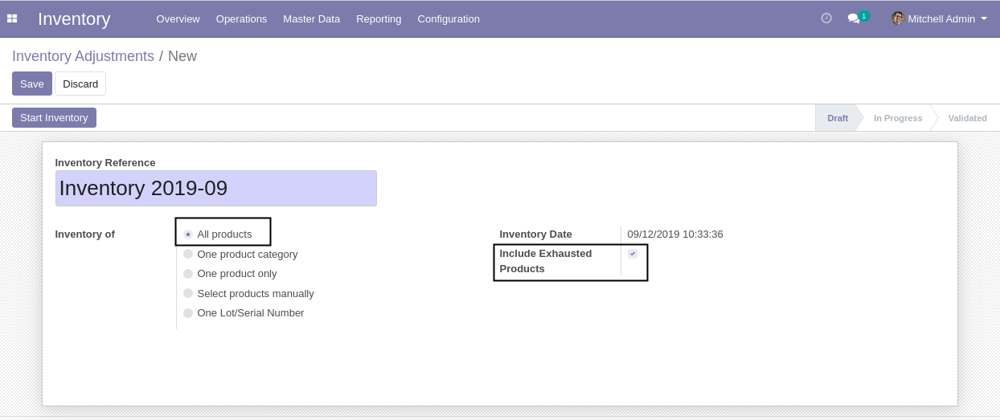
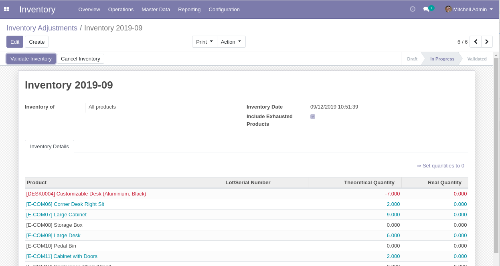
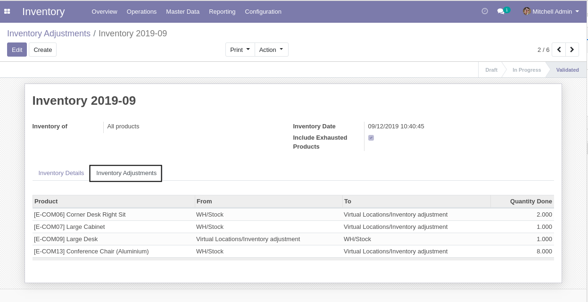

Stock Theoretical Quantity Access
=================================
This module hides the theoretical quantity on inventory adjustments.

.. contents:: Table of Contents

Context
-------
When the theoritical quantity is known, it can help employees to steal products unnoticed.

This is why we want only the manager to have access to this information.

Usage (as Employee)
-------------------
As member of ``Inventory / User``, I create a new inventory adjustment.

I select ``All Products``.

I notice that the ``Include Exhausted Products`` checkbox is automatically checked.
I can not uncheck the box.

..

    This prevents employees from knowing which products are exhausted.

I start the inventory.

I notice that:

* The column ``Theoretical Quantity`` is hidden.
* The column ``Real Quantity`` contains only zeros.
* The lines are not colored.

I validate the inventory.

I notice that I can not see the tab containing the generated stock moves.

Usage (as Manager)
------------------
As member of ``Inventory / Manager``, I create a new inventory adjustment.

I select ``All Products``.

I notice that the ``Include Exhausted Products`` checkbox is automatically checked.
However, I can manually uncheck the box.

I start the inventory.

I notice that:

* The column ``Theoretical Quantity`` is visible.
* The column ``Real Quantity`` contains only zeros.
* The lines are colored based on their theoretical quantity.

I validate the inventory.

I can see the tab containing the generated stock moves.

Contributors
------------
* Numigi (tm) and all its contributors (https://bit.ly/numigiens)
