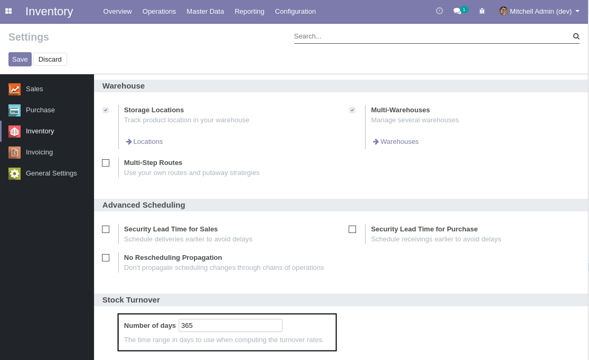
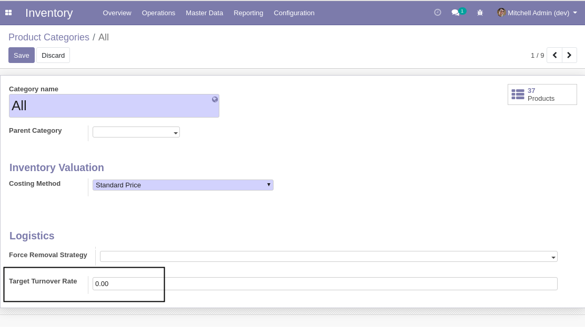
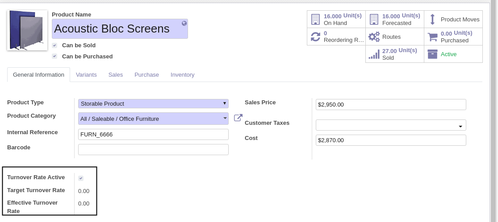
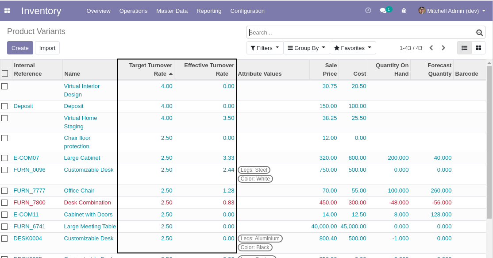
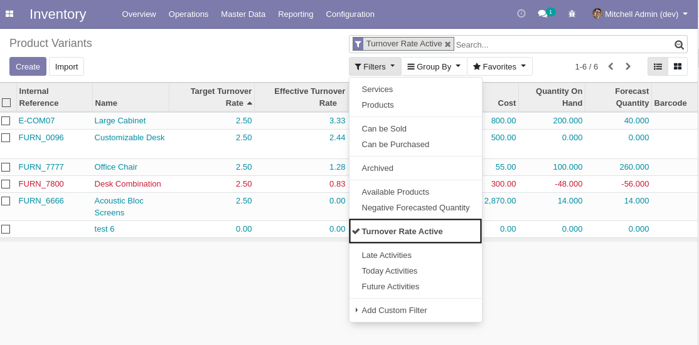

Stock Turnover Rate
===================
This module adds a ``Stock Turnover`` rate field to products.

.. contents:: Table of Contents

Summary
-------
The rate defined in this module is based on quantities instead of monetary value.

It is computed as follow:

..

    ``Delivered Quantity [J-366:J-1] / Average Quantity In Stock``

Where ``Average Quantity In Stock`` is defined as:

..

    ``(Quantity [J-366] + Quantity [J-1]) / 2``

Configuration
-------------

Turnover Period
~~~~~~~~~~~~~~~
The number of days of the period is 365 by default. This value can be parametrized through the web interface.
The value is however unique system-wide.

To customize the value, go to ``Inventory / Configuration / Settings``.

Product Categories
~~~~~~~~~~~~~~~~~~
As member of ``Inventory / Manager``, I go to the form view of a product category.

I notice a new field ``Target Turnover Rate``.

The value of this field is propagated to the products directly under the category.

Products
~~~~~~~~
As member of ``Inventory / Manager``, I go to the form view of a product.

I notice the following new field:

* ``Active Turnover Rate``

..

    This checkbox allows to identify products to include in turnover reports.
    Some products are not relevant in such report (consumable products for example).

    This module does not define a turnover report.
    For such report, you may use your favorite reporting engine.

* ``Target Turnover Rate``

..

    This field is readonly.
    It is inherited from the value defined on the product category.

* ``Effective Turnover Rate``

..

    This field is readonly.
    It contains the rate computed for this product.

List Views
----------
In list view of products, I can see the target and effective turnover rates.

A filter allows to search for products with ``Active Turnover Rate`` checked.

Contributors
------------
* Numigi (tm) and all its contributors (https://bit.ly/numigiens)
