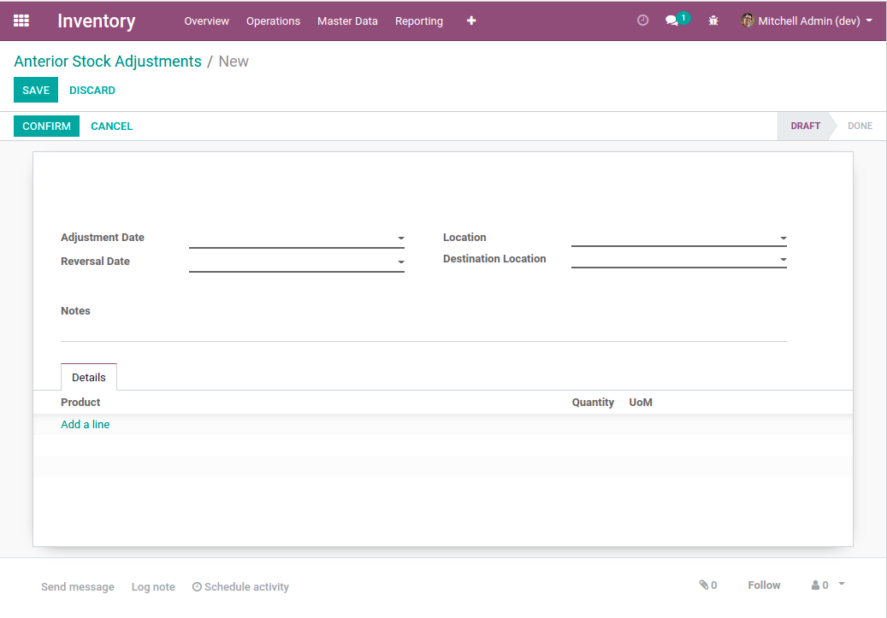

Stock Virtual Adjustment
========================
This module allows to ajust the quantity of a product in inventory at a given date in the past.

.. contents:: Table of Contents

Context
-------

Stock Operations
~~~~~~~~~~~~~~~~
In vanilla Odoo, inventory operations are done at the current time.

Moving a product at a date in the past would be complex, because it would impact
all subsequent operations.

When moving a product, quants are modified / created / deleted in the source and destination locations.

The system would need to verify that quants in the source location could be reserved at a past date,
given that it could have been modified since.

Stock Valuation
~~~~~~~~~~~~~~~
In vanilla Odoo, there are 3 costing method:

* Standard Price
* Average Cost
* FIFO

``Standard Price`` / ``Average Cost``
*************************************
These two methods work pretty much the same way.

A table (``product.price.history``) contains the unit cost of a product at a given time.

The accounting valuation at a given time is:

..

	``Quantity in stock`` x ``Unit Cost``

If you want to change the product valuation of the product at a given time,
you need to either change the quantity in stock or the historic price at that time.

FIFO
****
This method is much more complicated in Odoo.

Some kind of matching is done between incoming stock moves and outgoing stock moves
to determine the value of outgoing moves, and therefore, the residual value in inventory.

It would be much more complex to ajust the stock valuation at a prior period for
products under this costing method. At least, without risking to introduce side effects.

Therefore, this module does not support ajusting valuation for products with FIFO valuation.

Accounting
~~~~~~~~~~
This module does not change the accounting valuation of stocks.
It does not generate journal entries.

This could be implemented in another module.

Overview
--------
This module adds ``Virtual Adjustments``.

When validating a virtual adjustment, two stock moves are created for each product.

* One move at the adjustment date
* One opposite move at the reversal date

The current inventory is not impacted by the module.
The inventory is only ajusted for a period of time in the past.

The stock moves are created directly with the status ``Done``.
No quant are actually moved.

Usage
-----
As member of the group ``Inventory / Manager``, I go to ``Inventory / Operations / Anterior Adjustments``.

.. image:: static/description/virtual_adjustment_list.png

I create an adjustment.

I select an adjustment date and a reversal date.

I select a source and a destination location.

For each product, I add a line with the quantity to adjust.

I confirm the adjustment.

Once the adjustment confirmed, I notice a new smart button ``Stock Moves``.

When I click on the button, the list of stock moves (incoming and outgoing appears).

Constraints
-----------

Dates
~~~~~
The selected dates of adjustment and reversal must be in the past.

The adjustment date must be prior to the date of reversal.

Costing Method
~~~~~~~~~~~~~~
The selected products must be valued either at ``Standard Price`` or ``Average Cost``.

Contributors
------------
* Numigi (tm) and all its contributors (https://bit.ly/numigiens)
