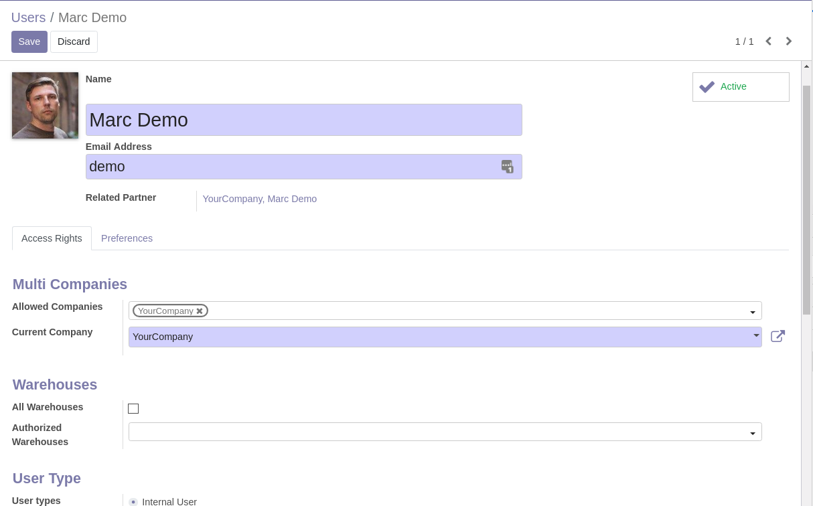
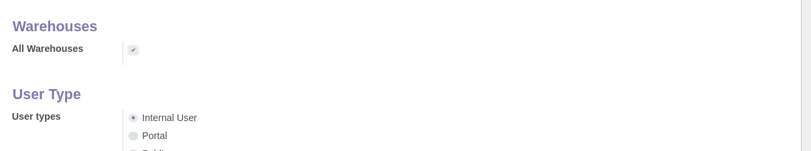
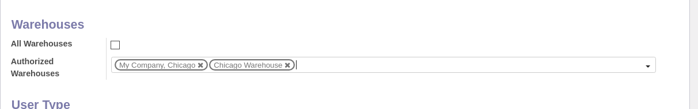
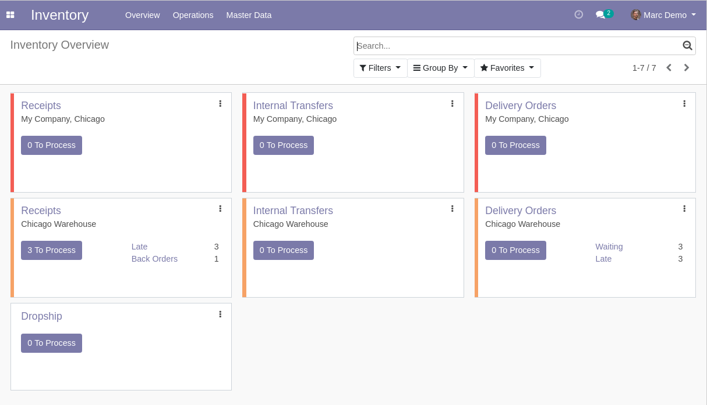
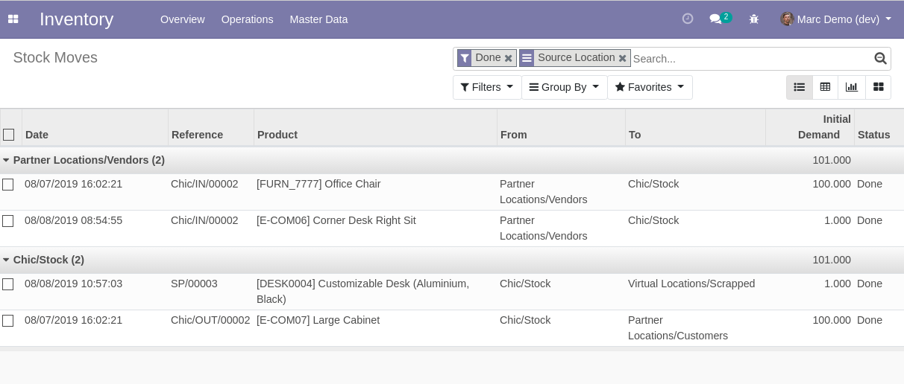

Stock Warehouse Access
======================
This module adds extra access rules to the ``Inventory`` application.

.. contents:: Table of Contents

Summary
-------
Users are assigned to one or multiple warehouses.

They can only access inventory objects from their assigned warehouse.

These objects include:

* Inventories
* Locations
* Packages
* Scrap Entries
* Stock Move Lines
* Stock Moves
* Stock Picking Types
* Stock Pickings
* Stock Quants
* Warehouses

Objects related to no warehouses are visible to all users.

The new rules defined by the module are independant from multi-company rules.

These rules are applied to all users (even OdooBot), not just basic members of the ``Inventory / User``.

The module only restricts web requests. It has no impact on the internal behavior of Odoo.
Therefore, you can but do not need to apply specific rules to OdooBot.

Configuration
-------------
As system administrator, I go to the form view of a user.

I notice 2 new fields:

* All Warehouses
* Authorized Warehouses

If I check ``All Warehouses``, the user is allowed to access the data of all warehouses.

If I let ``All Warehouses`` unchecked, then only the warehouses selected in ``Authorized Warehouses`` are authorized for this user.

Usage
-----
As member of the group ``Inventory / User``, I go to the ``Inventory`` app.

I notice that only operation types of my own warehouse are displayed.

If I go to the list of stock moves, I notice the same behavior.

Contributors
------------
* Numigi (tm) and all its contributors (https://bit.ly/numigiens)
