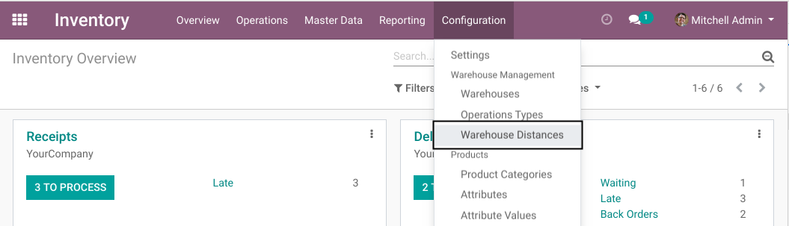
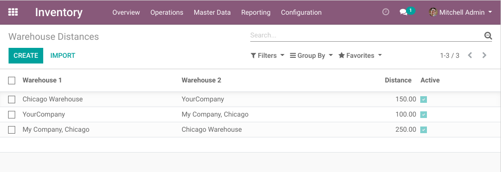
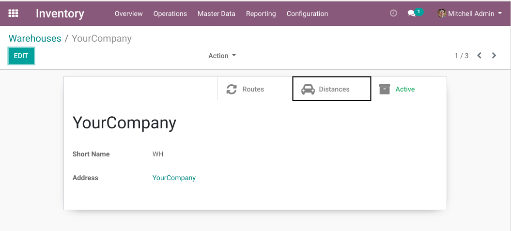
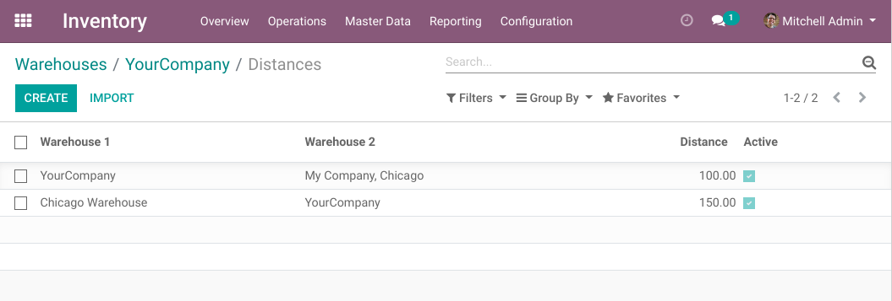

Warehouse Distances
===================
This module adds distances between warehouses.

.. contents:: Table of Contents

Distances
---------
A new menu entry is added under ``Inventory / Configuration / Warehouse Distances``.

When clicking on the menu entry, the list of all distances between warehouses is displayed.

Units
~~~~~~~~~~
Distances are defined in kilometers.

Reflexive
~~~~~~~~~
Distances are reflexive.
Whether some warehouse is defined as ``Warehouse 1`` or ``Warehouse 2`` has no importance.

Warehouse Smart Button
----------------------
In the form view of a warehouse, a smart button is added to access the distances for this warehouse.

When clicking on the button, the list of distances related to this warehouse is displayed.

Computing Distances
-------------------
The goal of this module is to compute a distance between 2 warehouses.

Therefore, a helper method ``distance_from`` is added on warehouse.
Here is an example of usage.

.. code-block:: python

    warehouse_a = env['stock.warehouse'].browse(1)
    warehouse_b = env['stock.warehouse'].browse(2)
    distance = warehouse_a.distance_from(warehouse_b)
    print(distance)

The result is a float representing the number of kilometers between the 2 warehouses.

Note that ``warehouse_a.distance_from(warehouse_b)`` and ``warehouse_b.distance_from(warehouse_a)``
will always give the same result.

If no distance is defined between the 2 warehouse, an exception is raised.

Known Issues
------------
For now, the distances are defined in kilometers.
An improvement to the module would be to support multiple units of measure.

Contributors
------------
* Numigi (tm) and all its contributors (https://bit.ly/numigiens)
